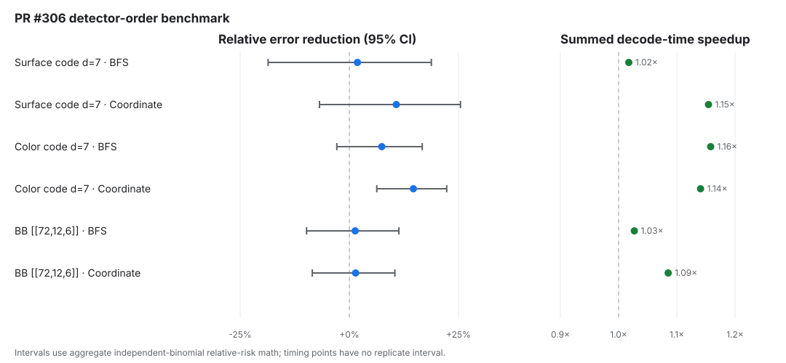

# PR #306 detector-order benchmark

Failures are `num_errors + num_low_confidence`; intervals are Wilson 95%. The timing field is summed per-shot decode time, not process CPU time. Fisher p-values treat the aggregate samples as independent; identical sample seeds do not provide the per-shot discordance needed for a paired test.

| Circuit (p=0.002) | Ordering | Baseline failures (95% CI) | Candidate failures (95% CI) | Relative error reduction | Fisher p (independent) | Baseline summed decode time | Candidate summed decode time | Speedup |
|---|---|---:|---:|---:|---:|---:|---:|---:|
| Surface code d=7 | BFS | 216 / 100,000 0.216% [0.189%, 0.247%] | 212 / 100,000 0.212% [0.185%, 0.242%] | +1.9% ± 9.5% 95% CI [-18.6%, +18.8%] | 0.8846 | 2,795.4s wall 45.0s | 2,747.4s wall 44.3s | 1.02× |
| Surface code d=7 | Coordinate | 251 / 100,000 0.251% [0.222%, 0.284%] | 224 / 100,000 0.224% [0.197%, 0.255%] | +10.8% ± 8.2% 95% CI [-6.8%, +25.5%] | 0.2323 | 3,164.3s wall 50.7s | 2,741.0s wall 44.3s | 1.15× |
| Color code d=7 | BFS | 713 / 100,000 0.713% [0.663%, 0.767%] | 660 / 100,000 0.660% [0.612%, 0.712%] | +7.4% ± 5.0% 95% CI [-2.9%, +16.7%] | 0.1590 | 31,123.9s wall 490.4s | 26,873.5s wall 423.8s | 1.16× |
| Color code d=7 | Coordinate | 941 / 100,000 0.941% [0.883%, 1.003%] | 803 / 100,000 0.803% [0.750%, 0.860%] | +14.7% ± 4.1% 95% CI [+6.3%, +22.3%] | 9.79e-04 | 38,533.0s wall 606.4s | 33,777.1s wall 531.4s | 1.14× |
| BB [[72,12,6]] | BFS | 671 / 100,000 0.671% [0.622%, 0.724%] | 662 / 100,000 0.662% [0.614%, 0.714%] | +1.3% ± 5.4% 95% CI [-9.8%, +11.4%] | 0.8260 | 80,883.1s wall 1,274.6s | 78,757.6s wall 1,241.2s | 1.03× |
| BB [[72,12,6]] | Coordinate | 836 / 100,000 0.836% [0.781%, 0.894%] | 824 / 100,000 0.824% [0.770%, 0.882%] | +1.4% ± 4.8% 95% CI [-8.5%, +10.4%] | 0.7863 | 104,047.3s wall 1,638.9s | 95,884.5s wall 1,508.0s | 1.09× |

Raw inputs and provenance are retained alongside this report.
